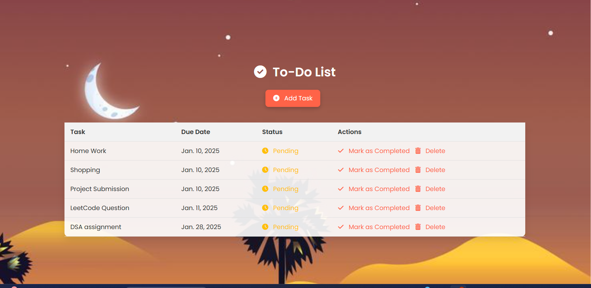
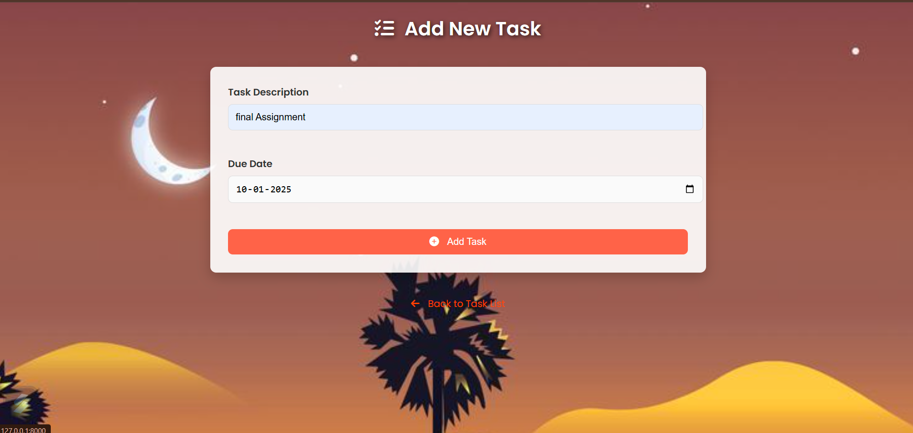

# To-Do List with Due Dates Using Python & Django (DSA Project) 📅

## Introduction 
This project is a simple To-Do List application built with Python and Django that focuses on using Data Structures and Algorithms (DSA) concepts. The primary goal is to manage tasks with due dates and implement sorting functionality to order tasks based on their due dates. Unlike traditional implementations, this project uses in-memory data storage (a Python list) instead of a database, emphasizing lightweight and efficient operations. 📊

---

## Problem Domain 
Managing tasks effectively is a challenge in personal and professional contexts. Organizing tasks by their due dates and tracking their completion status can become cumbersome without a dedicated tool. Existing solutions may require complex setups or external databases, making them less suitable for quick, lightweight projects. ❓

---

## Solution Domain 
The proposed solution is a lightweight, Django-based To-Do List application that: 
- Stores tasks in memory using a Python list.
- Sorts tasks by due dates using algorithms for efficient task management.
- Allows users to add, view, mark as completed, and delete tasks.
- Uses HTML and CSS for a simple yet effective frontend interface.

This approach eliminates the need for a database, making it ideal for educational purposes and demonstrating DSA concepts. ✨

---

## Requirements 

### Functional Requirements: 
1. Add tasks with a description and due date. 🔄
2. View all tasks sorted by due dates. 🔧
3. Mark tasks as completed. ✅
4. Delete tasks. 🚮

### Non-Functional Requirements: 
1. Lightweight and fast. 🏋‍♂️
2. Easy to set up and run without database dependencies. ✔
3. Clean and intuitive user interface. 🎨

### Tools and Technologies: 
1. **Frontend**: HTML, CSS
2. **Backend**: Django (Python)
3. **Data Storage**: Python list (in-memory storage) 🔢

---

## Methodology 

### Step 1: Setting Up the Django Project 
1. Create a Django project and app.
2. Configure the project’s settings and URLs. 🔧

### Step 2: Define In-Memory Data Storage 
- Use a Python list to store tasks. Each task is represented as a dictionary with keys for description, due date, and completion status. 🔢

### Step 3: Implement Views 
1. **Index View**: Displays all tasks sorted by due dates. 🗃️
2. **Add Task View**: Allows users to add a new task. ➕
3. **Mark Completed View**: Updates the task’s completion status. ✅
4. **Delete Task View**: Removes a task from the list. 🚮

 

### Step 4: Create Templates 
- Design HTML templates for displaying tasks and forms. 🔄
- Use CSS for styling. 🎨

### Step 5: Sorting Algorithm 
- Implement sorting of tasks by due dates using Python’s `sorted()` function, which utilizes the Timsort algorithm for efficiency. 🔄

### Step 6: Run the Application 
- Start the Django development server. 🌐
- Interact with the application through the browser. 🔧

---

## Conclusion 
This project demonstrates the use of Django for building a practical application without relying on a database. By utilizing in-memory storage and implementing sorting algorithms, it highlights the integration of DSA concepts into real-world projects. The To-Do List application is a lightweight, easy-to-use tool for task management, perfect for educational purposes or quick implementations. ✨

---
